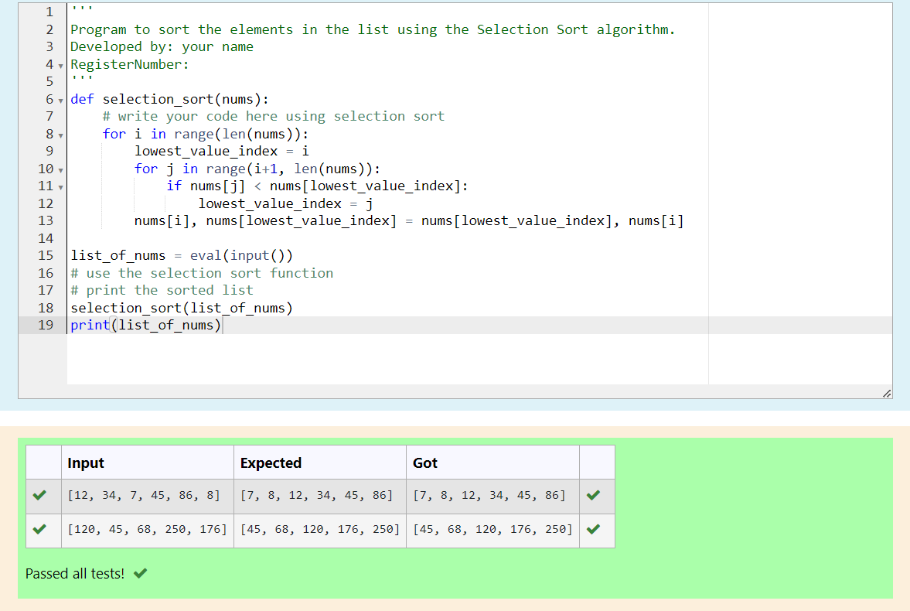
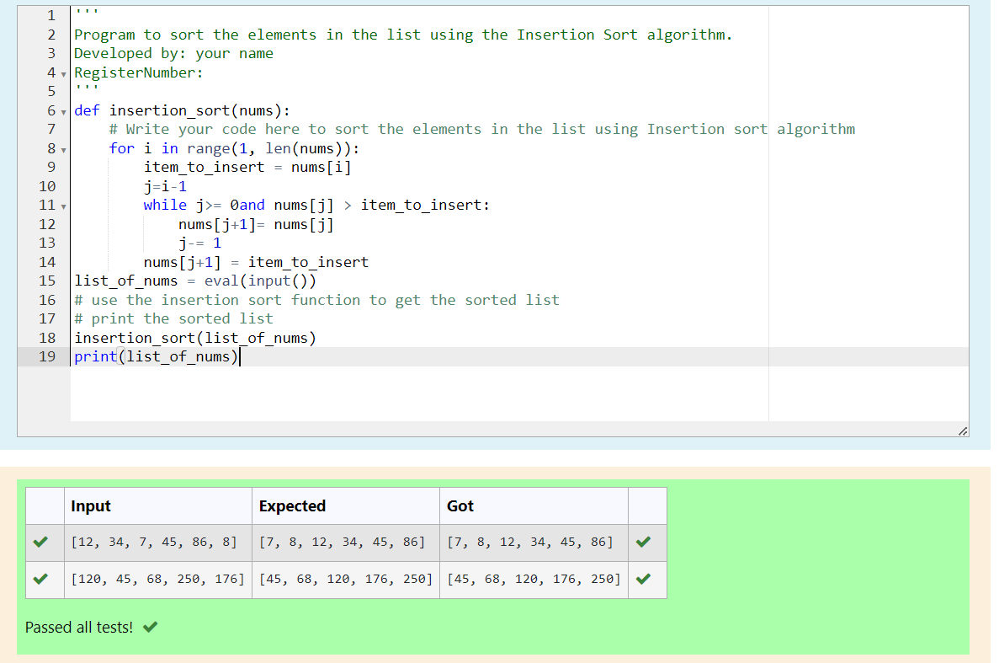

# Selection sort and Insertion sort
## Aim:
To write a program to perform selection sort and insertion sort using python programming.
## Equipment’s required:
1.	Hardware – PCs
2.	Anaconda – Python 3.7 Installation / Moodle-Code Runner
## Algorithm:
## Selection Sort Algorithm:
1.	Set the first unsorted element as the minimum
2.	For each of the unsorted elements, check if the element < current minimum.
3.	If yes, set the element as the new minimum.
4.	Swap minimum with first unsorted position.
5.	Repeat the steps 2 and 3 for all the elements in the array.
## Insertion Sort Algorithm:
1.	Set the first element as sorted element j.
2.	For each unsorted element X, check if current sorted element j >X.
3.	If yes, move sorted element to the right by 1.
4.	Break the loop and insert X.
5.	Repeat the steps 2 to 4 for sorting all the elements in the array.
## Program:
''' 
Program to sort the elements in the list using the Insertion Sort algorithm.
Developed by: VARSHINI D
RegisterNumber: 212223230234
'''
i)	#Selection Sort
```
def selection_sort(nums):
    # write your code here using selection sort
    for i in range(len(nums)):
        lowest_value_index = i
        for j in range(i+1, len(nums)):
            if nums[j] < nums[lowest_value_index]:
                lowest_value_index = j
        nums[i], nums[lowest_value_index] = nums[lowest_value_index], nums[i]

list_of_nums = eval(input())
# use the selection sort function
# print the sorted list
selection_sort(list_of_nums)
print(list_of_nums)

```
ii)	#Insertion Sort
```
def insertion_sort(nums):
    # Write your code here to sort the elements in the list using Insertion sort algorithm
    for i in range(1, len(nums)):
        item_to_insert = nums[i]
        j=i-1
        while j>= 0and nums[j] > item_to_insert:
            nums[j+1]= nums[j]
            j-= 1
        nums[j+1] = item_to_insert
list_of_nums = eval(input())
# use the insertion sort function to get the sorted list
# print the sorted list
insertion_sort(list_of_nums)
print(list_of_nums)

```

## Output:



## Result:
Thus the program is written to perform selection sort and insertion sort using python programming.
